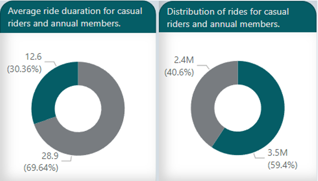
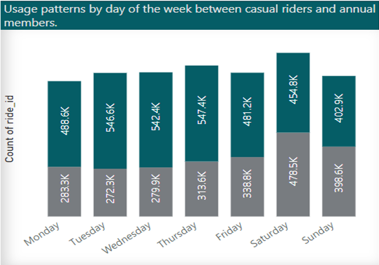
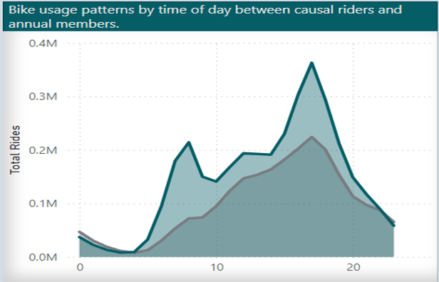
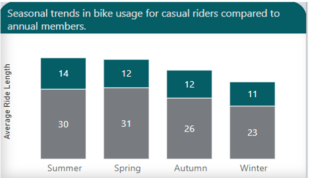
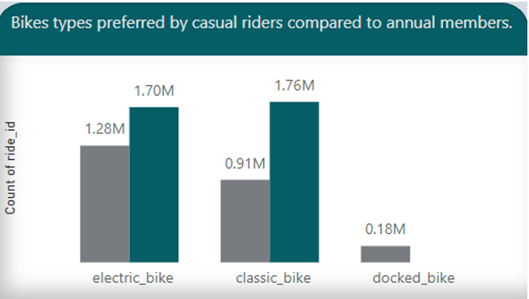

# How do Cyclistic’s casual riders and annual members use Cyclistic’s bikes differently?

# **Introduction**

Cyclistic: A bike-share program that features more than 5,800 bicycles and 600 docking stations. Cyclistic sets itself apart by also offering reclining bikes, hand tricycles, and cargo bikes, making bike-share more inclusive to people with disabilities and riders who can’t use a standard two-wheeled bike. Most riders opt for traditional bikes; about 8% of riders use the assistive options. Cyclistic users are more likely to ride for leisure, but about 30% use them to commute to work each day. 

This project seeks to understand how casual riders and annual members use Cyclistic bikes differently. Insights from the data analysis will help the marketing team design marketing strategies to convert casual riders into annual members. 

# **Problem statement**

The aim of this project is to analyze Cyclistic’s bike-trip historical data to identify how casual riders and annual members use Cyclistic bikes differently. The marketing team believes that maximizing annual members is key to future growth and converting casual riders into annual members would help achieve that since casual riders are already aware of the Cyclistic program and have chosen Cyclistic for their mobility needs.

# **Business Questions**

**Key Business Question: How do Cyclistic’s casual riders and annual members use Cyclistic’s bikes differently?**

The following questions will guide our analysis and the insights will help us answer the business question. 

* What are the differences in ride duration between casual riders and annual members?   
* How do the usage patterns vary by day of the week between casual riders and annual members?  
* How do the usage patterns vary by time of day between casual riders and annual members?  
* What are the seasonal trends in bike usage for casual riders compared to annual members?  
* What types of bikes (rideable type) are preferred by casual riders compared to annual members?

# **Data Source**

Cyclistic’s historical trip data was used to analyze and identify trends. The previous 12 months (March 2022 – February 2023\) of trip data were downloaded from [Index of bucket "divvy-tripdata"](https://divvy-tripdata.s3.amazonaws.com/index.html). The data was made available by Motivate International Inc. under this [Data License Agreement | Divvy Bikes](https://divvybikes.com/data-license-agreement).

The datasets were downloaded and stored in a local folder called Cyclistic Data. 

# **Skills demonstrated.**

* Data cleaning  
* Data Visualization  
* Python  
* Power BI  
* Data Analysis  
* Data Management  
* Source Control (Git)  
* Problem solving  
* Critical Thinking

# **Data Transformation/Cleaning**

The dataset was duplicated and stored in a folder. A copy was loaded into Python’s Pandas package for pre-cleaning and transformation. 

The following steps were taken to clean and transform the data for analysis.

* The monthly datasets were combined into a single dataset.  
* The appropriate data types for each column were specified.   
* Year, month, weekday, and hour columns were extracted from the date columns.  
* Calculated column (ride length) was created.  
* Columns were renamed.  
* Text columns were properly formatted by using the trim and clean functions.  
* Duplicate rows were removed.

# **Data Analysis**

## **Exploratory Data Analysis**

Combined, the data contained 5.8 million rides from March 2022 to February 2023\. 3.5 million annual members and 2.4 million casual rides. The maximum ride length was 0 minutes while the maximum ride length was 1068 minutes. 

![Dashboard][image1]

## **What are the differences in ride duration between casual riders and annual members?** 

**Insight**: Despite having more annual members (40.6%), Cyclistic casual riders had a longer average ride length (28.9 minutes) than annual members.

## **How do the usage patterns vary by day of the week between casual riders and annual members?**

**Insight:** Casual riders tend to use Cyclistic’s bikes during weekends (Friday, Saturday, Sunday) compared to annual members whose usage are higher during weekdays. 

This might be because annual members use bikes to commute to work, while casual members use bikes more for leisure during weekends. 

## **How do the usage patterns vary by time of day between casual riders and annual members?**

**Insight:** While both type of rides peak by 5pm, the annual members have two peak usage time-of-day – 8am and 5pm. This further establishes the fact that annual members use Cyclistic bikes for commuting to and from work. 

However, as seen from the line chart above, the same usage pattern seems to be the case for some casual users. This could be casual users who also use Cyclistic bikes to commute to and from work but are not annual members. 

## **What are the seasonal trends in bike usage for casual riders compared to annual members?**

**Insights:** Overall, both casual riders and annual members use the bikes more in summer than other seasons of the year. As presented in the chart below, both ride-types tend to have longer ride lengths in summer, closely followed by spring.

## **What types of bikes (rideable type) are preferred by casual riders compared to annual members?**

**Insight:** Cyclistic’s electric bike is the most preferred bike type among all riders. However, annual members have a slightly higher preference for classic bikes over electric bikes and do not even use the docked bike at all. 

**Casual riders on the other hand prefer the electric bike to the classic bike. This preference accounts for the longer ride length in casual riders. It also suggests that casual riders travel longer distance compared to annual members. They also use the docked bike unlike annual members. Further analysis**

# **Visualization**

![Dashboard][image1]

# **Conclusion/Insights**

Annual members are more likely to use Cyclistic’s bikes during weekdays while Casual riders use Cyclistic bikes more on weekends – Friday to Sunday. This suggests that annual members use Cyclistic bikes to commute to or from work and causal riders probably use the bikes for leisure or more specific purposes.

Casual riders have longer ride length compared to annual members. They are also the only docked bike users. Due to their commute distance, they prioritize the use of electric bikes. Probably due to the shorter commute time, annual members have preference for Cyclistic’s classic rideable type. 

5pm is the peak usage time for both rider category. However, annual members have a second peak usage time of 8am. This further corroborates our findings that annual members might use Cyclistic bike to commute to and from work- or generally periodically during the day. 

Casual riders also show a similar pattern in terms of peak usage hour of day. Suggesting that there are casual riders who use Cyclistic bike for commute purposes.  

In conclusion, annual members use Cyclistic bikes more frequently but for shorter ride lengths during the week, while causal riders have longer ride duration but with fewer rides compared to annual members. 

# **Recommendation** 

1. Cyclistic should target their ads to causal members who use their bikes for commuting to or from work. This category of riders are frequent users and have need for using the bikes throughout the year. These users wont mind paying for annual membership at a relatively discounted amount. 

2. Cyclistic can offer Casual members who use their bikes for a longer time during rides but less frequently a monthly or quarterly membership option. The usage pattern observed from these riders suggest that they use Cyclistic’s bike for specific purposes which could be for leisure since the location is a coastal area known for its tourist attractions. 

3. Finally, the marketing team could organize summer campaigns as this is the peak usage time of the year. Users can use their membership status to access perks and special privileges during peak periods and bikes shortages. 

# **Limitation**

The data provided is not comprehensive enough to make certain conclusions. Hence, more information is needed to ascertain our claims. Data like purpose of ride, information about the price structure of rides as well as the distinct number of customers by rider type will help uncover more usage patterns among riders. 

### Appendix

Cover Photo by [Leonardo Zorzi](https://unsplash.com/@leonardozorzi?utm_content=creditCopyText&utm_medium=referral&utm_source=unsplash) on [Unsplash](https://unsplash.com/photos/man-in-black-jacket-and-black-pants-riding-bicycle-on-road-during-daytime-Ho_dUeaaV0o?utm_content=creditCopyText&utm_medium=referral&utm_source=unsplash)